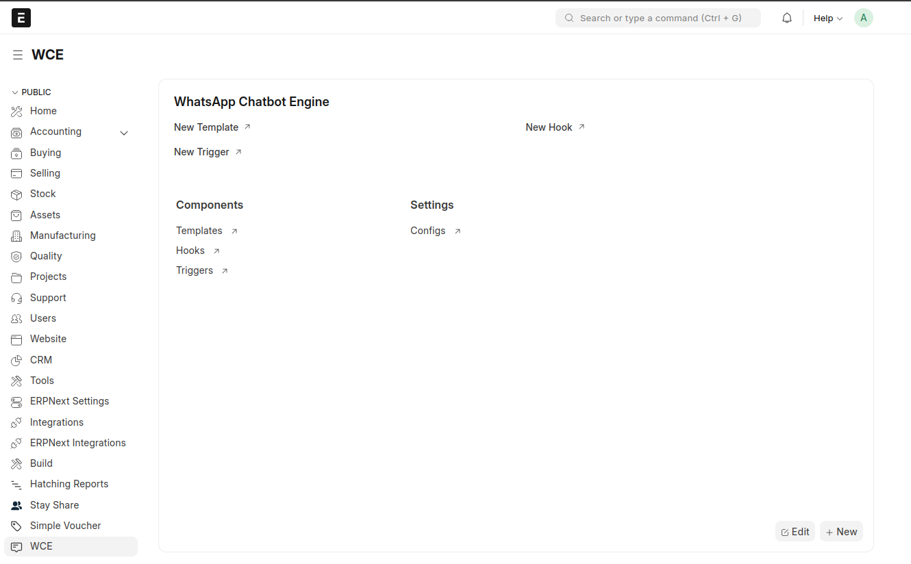
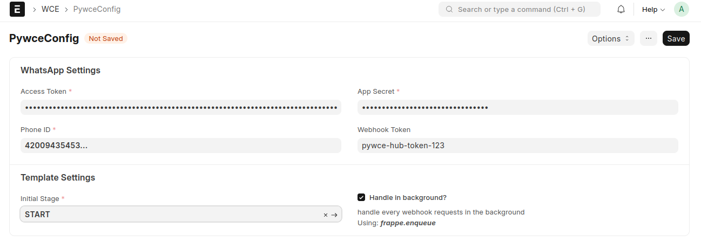
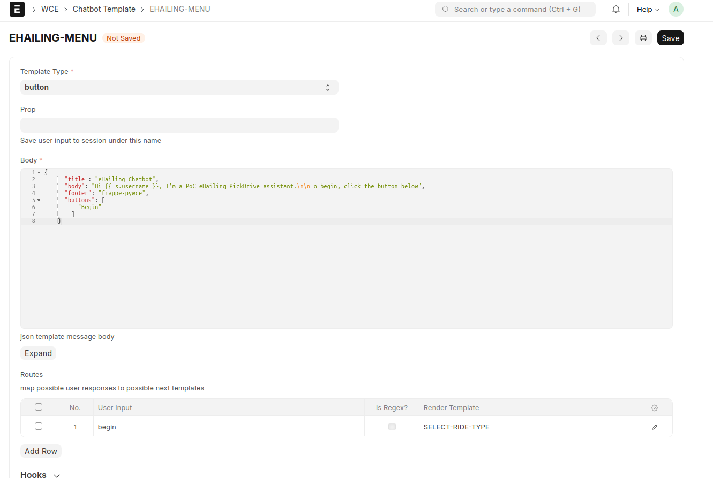
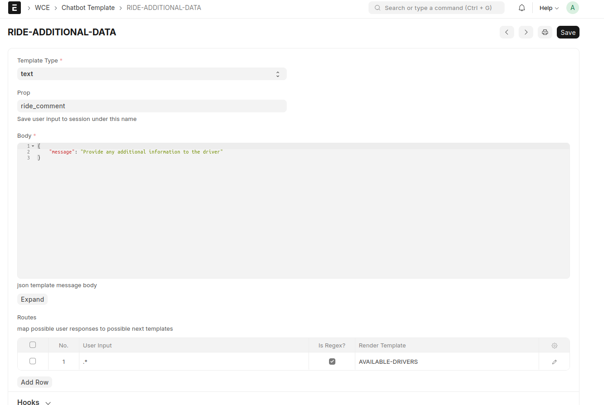
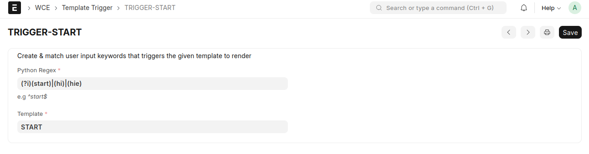
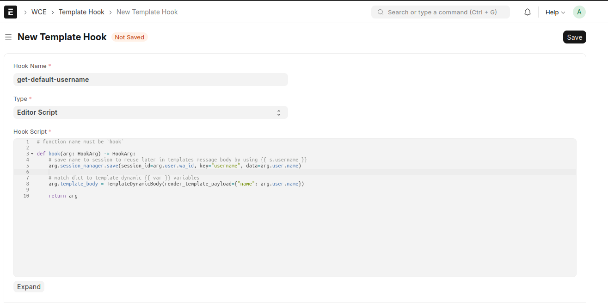
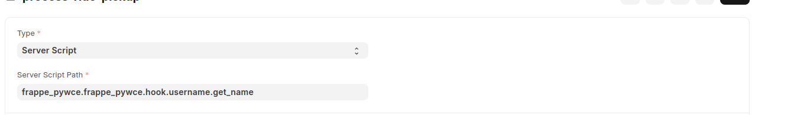

# Frappe Pywce
A WhatsApp chatbot engine in frappe powered by [Pywce](https://github.com/DonnC/pywce)



## Features
- [x] Create a chatbot from frappe desk UI
- [x] Doctype driven chatbot
- [x] Chatbot changes reflect instantly on WhatsApp
- [x] Improved performance via background processing using `frappe.enqueue(...)`
- [x] Frappe dependent business logic via server side scripts-like approach or directly on UI
- [x] Support for all features of pywce

## Setup
Install app 
```bash
$ bench get-app --branch main frappe_pywce https://github.com/DonnC/frappe_pywce.git

# install on site
$ bench --site `site-name` install-app frappe_pywce
```

### Configure
Navigate to `app settings > Configs` to add your whatsapp configs




### Create templates
You can add any templates of your choice, example templates below

btn


text


### Create triggers
Create your conversation starters or triggers. These enable you to listen to specific user input which results in showing user a specific template



### Create business logic
To define business logic on a template, you create a hook.
> E.g fetch a user sales invoices when they request for one.

A hook is defined as either a editor script (in the desk ui like creating frappe server scripts) or as server side scripts (on the server).

> All hooks takes a [Hook Arg](https://docs.page/donnc/wce/common/hooks/introduction) object as a parameter

#### Editor Script
*All editor scripts should have a single function named **hook***



#### Server side script

Add a dotted path to your server side script


## Documentation

Visit the [official wce documentation](https://docs.page/donnc/wce/frappe) for a detailed guide.

## Contributing

We welcome contributions! Please check out the [Contributing Guide](CONTRIBUTING.md) for details.

## License

This project is licensed under the MIT License. See the [LICENSE](license.txt) file for details.

